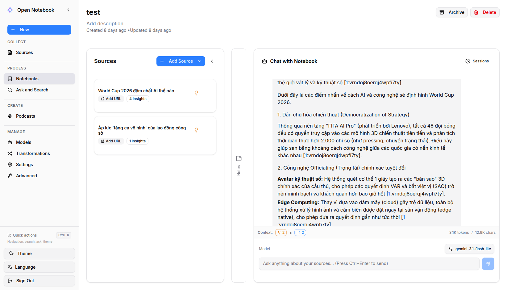
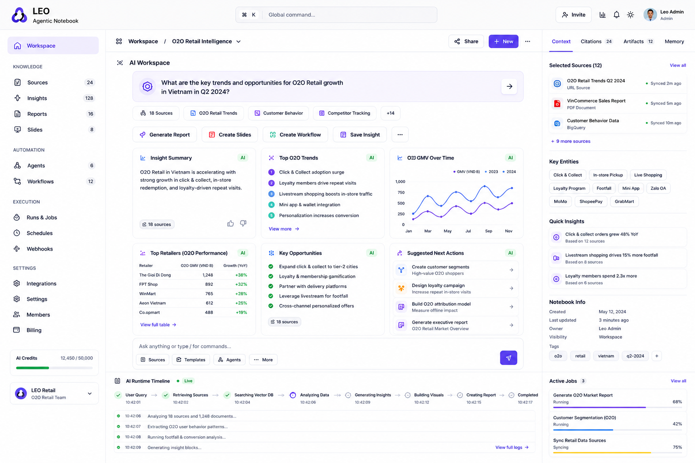
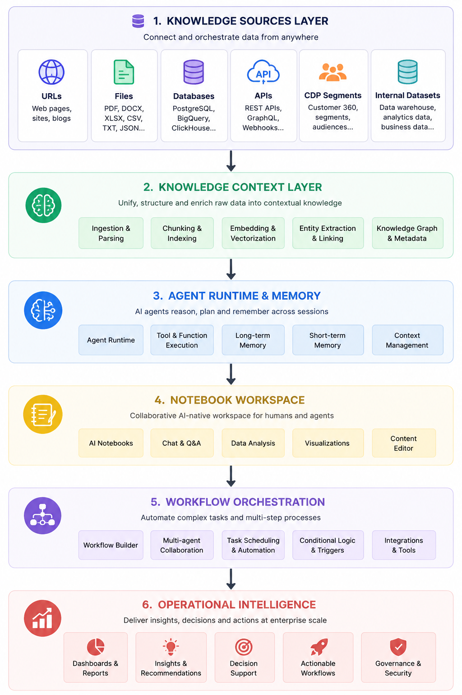

# LEO Agentic Notebook

🚀 AI-native workspace for enterprise knowledge orchestration, autonomous agents, and collaborative intelligence.

LEO Agentic Notebook transforms fragmented business data, documents, APIs, databases, and customer knowledge into an operational AI workspace where humans and AI agents collaborate together.

Current UI version 1.0


The UI of version 2.0


---

## ✨ Why LEO Agentic Notebook

Modern enterprises operate with:

* scattered documents
* disconnected databases
* siloed analytics systems
* fragmented customer platforms
* isolated AI workflows

LEO Agentic Notebook unifies these systems into a single AI-native operational workspace.

Built for:

* 🤖 AI-native teams
* 📊 Customer intelligence
* 🧠 Research & strategy
* 📈 Growth & marketing operations
* 🔄 Agentic AI workflows
* 🏢 Enterprise knowledge systems
* ⚡ Big Data & CDP environments

Unlike traditional AI notebooks, LEO Agentic Notebook provides:

* 🧩 Multi-source knowledge orchestration
* 🤖 AI agents and workflows
* 🧠 Unified business context
* 🔌 Enterprise-grade integrations
* 💾 Structured memory and retrieval
* 👥 Human + AI collaboration
* 🔒 Private and self-hosted deployment

> LEO Agentic Notebook is not just a note-taking tool.
> It is an AI operating system for knowledge work.

---

# 🧠 Core Features

## 🔗 Unified Knowledge Sources

Connect and orchestrate knowledge from:

* 🌐 URLs and websites
* 📄 PDFs, DOCX, XLSX, CSV
* 🗄️ PostgreSQL, BigQuery, ClickHouse
* 🔌 APIs and webhooks
* 👥 LEO CDP customer segments
* 📊 Internal datasets
* 🏗️ Data warehouse tables
* 📈 Marketing and analytics platforms

---

## 🤖 AI-native Workspace

* 🧠 AI-powered notebooks
* 💬 Persistent conversations
* 🗂️ Structured reasoning
* 🔍 Context-aware retrieval
* 🧩 Multi-session memory
* 👥 Collaborative research workflows
* ⚡ Human + AI co-working environment

## Provider Support Matrix

Thanks to the [Esperanto](https://github.com/lfnovo/esperanto) library, we support this providers out of the box!

| Provider     | LLM Support | Embedding Support | Speech-to-Text | Text-to-Speech |
|--------------|-------------|------------------|----------------|----------------|
| OpenAI       | ✅          | ✅               | ✅             | ✅             |
| Anthropic    | ✅          | ❌               | ❌             | ❌             |
| Groq         | ✅          | ❌               | ✅             | ❌             |
| Google (GenAI) | ✅          | ✅               | ❌             | ✅             |
| Vertex AI    | ✅          | ✅               | ❌             | ✅             |
| Ollama       | ✅          | ✅               | ❌             | ❌             |
| Perplexity   | ✅          | ❌               | ❌             | ❌             |
| ElevenLabs   | ❌          | ❌               | ✅             | ✅             |
| Azure OpenAI | ✅          | ✅               | ❌             | ❌             |
| Mistral      | ✅          | ✅               | ❌             | ❌             |
| DeepSeek     | ✅          | ❌               | ❌             | ❌             |
| Voyage       | ❌          | ✅               | ❌             | ❌             |
| xAI          | ✅          | ❌               | ❌             | ❌             |
| OpenRouter   | ✅          | ❌               | ❌             | ❌             |
| DashScope (Qwen) | ✅          | ❌               | ❌             | ❌             |
| MiniMax      | ✅          | ❌               | ❌             | ❌             |
| OpenAI Compatible* | ✅          | ❌               | ❌             | ❌             |

*Supports LM Studio and any OpenAI-compatible endpoint

---

## ⚙️ Agentic AI Runtime

* 🤖 Autonomous AI agents
* 🔄 Multi-step workflows
* 🧠 AI task orchestration
* ⚡ Workflow automation
* 🛠️ Tool integrations
* 🔗 Context-sharing between agents
* 🚀 AI operational pipelines

---

## 📊 Enterprise Intelligence Layer

* 👤 Customer 360 intelligence
* 📈 Marketing analytics
* 📦 Product analytics
* 📑 AI-powered reporting
* 🧠 Executive dashboards
* 🎯 Customer segmentation
* 📡 Behavioral intelligence
* 🏢 Decision support systems

---

## 🏗️ AI Infrastructure

* 🤖 Multi-model support
* 🧠 OpenAI, Anthropic, Gemini, Ollama
* 🔄 LangGraph orchestration
* 📚 RAG pipelines
* 🔎 Vector search
* 💾 Structured memory systems
* 🔒 Self-hosted deployment
* 🏢 Enterprise-ready architecture

---

# 🧩 Architecture

screenshot.png


```text
Knowledge Sources Layer
    ├── URLs
    ├── Files
    ├── Databases
    ├── APIs
    ├── CDP Segments
    └── Internal Datasets
                ↓
Knowledge Context Layer
                ↓
Agent Runtime & Memory
                ↓
Notebook Workspace
                ↓
Workflow Orchestration
                ↓
Operational Intelligence
```

---

# 🛠️ Built With

Keep the strong OSS ecosystem from the original project:

[![Python][Python]][Python-url]
[![Next.js][Next.js]][Next-url]
[![React][React]][React-url]
[![FastAPI][FastAPI]][FastAPI-url]
[![PostgreSQL][PostgreSQL]][PostgreSQL-url]
[![LangChain][LangChain]][LangChain-url]
[![LangGraph][LangGraph]][LangGraph-url]
[![Redis][Redis]][Redis-url]
[![TailwindCSS][TailwindCSS]][TailwindCSS-url]

Core technologies:

* ⚡ FastAPI
* ⚛️ Next.js
* 🎨 TailwindCSS + shadcn/ui
* 🧠 LangGraph
* 🔗 LangChain
* 🗄️ PostgreSQL
* ⚡ Redis
* 📊 Kafka
* 🔄 Celery / Temporal

---

# 🚀 Core Use Cases

## 👤 Customer Intelligence

* Customer 360 analysis
* Segmentation insights
* Behavioral analytics
* Marketing optimization

## 🧠 AI Research Workspace

* Multi-source research
* Knowledge synthesis
* AI-assisted analysis
* Strategic planning

## 🏢 Enterprise Knowledge Hub

* Internal documentation
* Organizational memory
* Cross-team collaboration
* Decision intelligence

## 🤖 AI Workflow Automation

* Agentic workflows
* Automated reporting
* Data enrichment
* AI operational pipelines

## 📈 Marketing & Growth Intelligence

* Campaign analysis
* Performance analytics
* Customer journey analysis
* AI-powered growth operations

---

# 🔓 Open Source Philosophy

LEO Agentic Notebook is designed as:

* open
* extensible
* AI-native
* enterprise-ready
* self-hosted
* developer-friendly

The goal is to provide an open platform where organizations can build their own AI-native operational intelligence systems without vendor lock-in.

---

# 📄 License

LEO Agentic Notebook

Copyright 2026 Triều and contributors

Licensed under the Apache License, Version 2.0

http://www.apache.org/licenses/LICENSE-2.0

---

# 🌍 Vision

From fragmented enterprise data
→ to connected knowledge
→ to autonomous intelligence
→ to AI-native organizations.

<!-- MARKDOWN LINKS -->

[Python]: https://img.shields.io/badge/Python-3776AB?style=for-the-badge&logo=python&logoColor=white
[Python-url]: https://www.python.org/
[Next.js]: https://img.shields.io/badge/Next.js-000000?style=for-the-badge&logo=next.js&logoColor=white
[Next-url]: https://nextjs.org/
[React]: https://img.shields.io/badge/React-61DAFB?style=for-the-badge&logo=react&logoColor=black
[React-url]: https://reactjs.org/
[FastAPI]: https://img.shields.io/badge/FastAPI-009688?style=for-the-badge&logo=fastapi&logoColor=white
[FastAPI-url]: https://fastapi.tiangolo.com/
[PostgreSQL]: https://img.shields.io/badge/PostgreSQL-336791?style=for-the-badge&logo=postgresql&logoColor=white
[PostgreSQL-url]: https://www.postgresql.org/
[LangChain]: https://img.shields.io/badge/LangChain-3A3A3A?style=for-the-badge&logo=chainlink&logoColor=white
[LangChain-url]: https://www.langchain.com/
[LangGraph]: https://img.shields.io/badge/LangGraph-000000?style=for-the-badge
[LangGraph-url]: https://www.langchain.com/langgraph
[Redis]: https://img.shields.io/badge/Redis-DC382D?style=for-the-badge&logo=redis&logoColor=white
[Redis-url]: https://redis.io/
[TailwindCSS]: https://img.shields.io/badge/TailwindCSS-38B2AC?style=for-the-badge&logo=tailwind-css&logoColor=white
[TailwindCSS-url]: https://tailwindcss.com/
